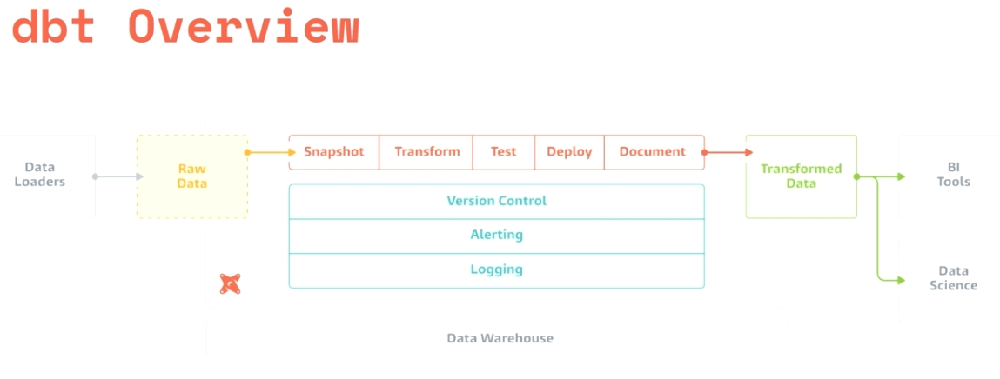
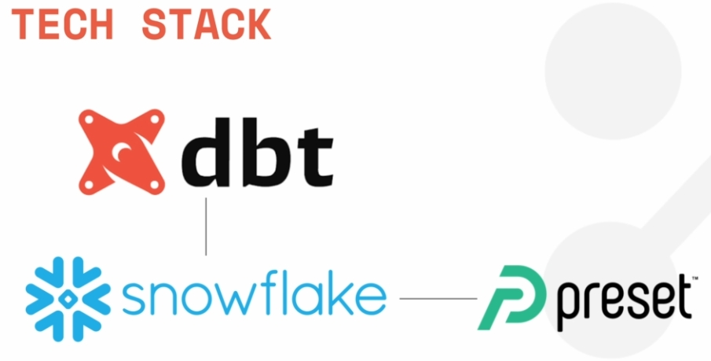
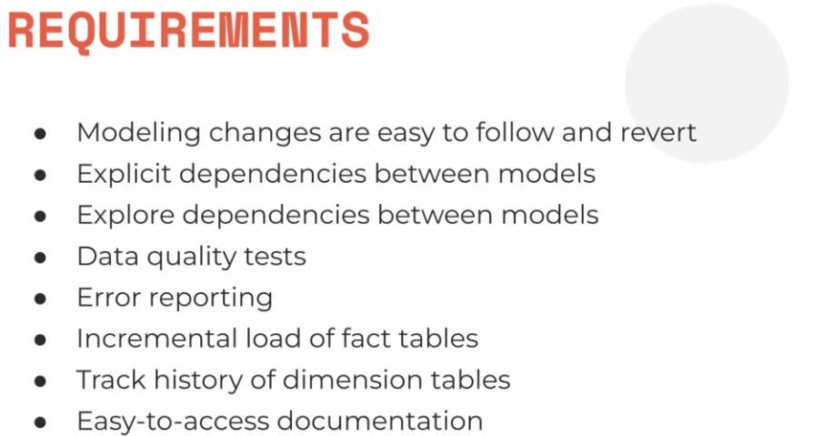

# Intro and Theory

## Normalização

A normalização é um processo para garantir que não haja

+ Duplicação de dados
+ Redundância de dados
+ Anomalias
Serve também para ficar mais simples de entender

### 1NF

Para ser 1NF precisa ter:

+ 1. As tabelas e as colunas das tabelas tem que serem atômicas
  + Não deve ser posśivel dividir os dados de uma célula
  + Por exemplo: Nomes: separar nos 3 nomes: first, middle e las
  + Por exemplo: Se você tem uma tabela que informa quais cômodos têm na sala não pode ter por exemplo uma row com 'air-conditioned, pool, root',
    + Solução: dividir em novas colunas
+ 2. Tem que haver um ID único para cada tabela, basicamente uma primary key
  + Isso garante que n^ao haja row totalmente  duplicadas

### 2NF

+ Consiste em dividir melhor os atributos, e na criação de novas entidades se houver colunas que não estejam relacionadas com as outras
+ Por consequência haverá então tabelas para relacionar as primary keys das tabelas geradas pelo 2NF

### 3NF

+ Se houver duas colunas que estão relacionadas, bastante relacionadas, formando quase que um par, ao invés de deixar as duas em uma tabela, cria-se uma nova tabelas.
+ Muito usadas para criar tabelas com constantes

## SCD - Slowly Changing Dimensions

O SCD é uma sigla que significa Slowly Changing Dimensions (Dimensões que Mudam Lentamente, em português) e retrata as dimensões que sofrem poucas atualizações em seus campos e os classificam pelo tipo de mudança existente em cada uma delas.

**Resumindo:** é um tipo de estrutura que ocorre a construção de DW. SCD é uma denominação para colunas no DW pois em DW nâo é criado para haver update.

### SCD Tipo 0 - retain original

The Type 0 dimension attributes never change and are assigned to attributes that have durable values or are described as 'Original'. Examples: Date of Birth, Original Credit Score. Type 0 applies to most date dimension attributes.

Resumindo: **Não muda o dado**

### SCD Tipo 1 - overwrite

O SCD Tipo 1 é a alteração que não armazena histórico na dimensão, ou seja, não é feito o versionamento do registro modificado. Trata-se do tipo mais simples, pois não há nenhum controle específico para a atualização dos dados, havendo apenas a sobreposição.

Resumindo: **Sobrescreve e perde o histórico de mudanças, chamado tracking**

### SCD Tipo 2 - add new row

This method overwrites old with new data, and therefore does not track historical data.

O SCD Tipo 2 é a técnica mais utilizada para atualizações de dimensões. Nesse tipo de SCD é adicionado um novo registro com as mudanças, preservando sempre os dados anteriores. Dessa forma, os registros da tabela fato vão apontar para a versão correspondente nas dimensões de acordo com a data de referência.

Resumindo:  **Adicionamos colunas informando o período em que aquela row é válida, assim , há registros repetidos (mantendo tracking) mas as datas ficam diferentes**

Resumindo:  **Ex: Você informa a data de start e end do registro, e no registro mais atual tem a 'end_date' como null**

### SCD Tipo 3 - add new attribute

O SCD Tipo 3 permite manter as modificações no mesmo registro. Essa técnica funciona com a adição de uma nova coluna na tabela de dimensão, onde é armazenada a atualização, mantendo na antiga coluna o valor anterior.

**Ao invés de criar uma row, cria uma nova colunas para a coluna a ser mudada. Assim há algo como 'antigo-endereço' e 'novo-endereço' na mesma tabela

## Use-Cases Airbnbn dbt

