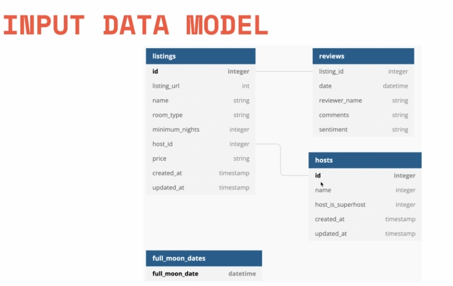
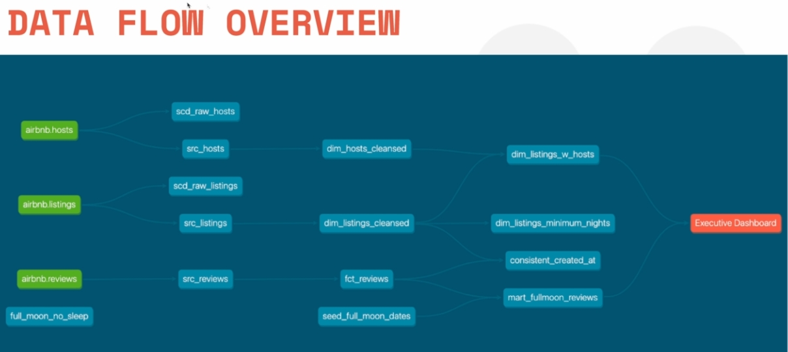

# Setup DBT

+ Link do git: <https://github.com/nordquant/complete-dbt-bootcamp-zero-to-hero>

## 1 - Como se Inscrever no Snowflake

+ Precisa de apenas um email
+ Depois escolha qual das principais clouds usar, mas você não precisa ter conta nelas, é só escolher qualquer uma mesmo
+ vai mandar um email de ativação, acesse e ative a sua conta
+ Ao ativar a conta (por usuário e senha) você vai para uma página. **SALVE O LINK DELA**
  + Por exemplo:
    + <https://mo5fas193.us-east467.gcp.snowflakecomputing.com/console>
  + Salve
    + `mo5fas193.us-east467.gcp`
+ Esse código que informa a zona da cloud será usada mais a frente

## Começando no Snowflake

+ O snowflake é como um mysql da vida
+ Vá em 'Worksheet e coloque o código dele (ta no pdf)
+ Antes vá em warehouse, e crie um novo (é mantendo esse warehouse em pé que tem  os gastos no snowflake mas como fizemso free, podemos gastar até um certo limite)
  + Crie um Warehouse com nome `COMPUTE_WH` pois é o nome usado nos códigos
+ Desde que isso esteja configurado, o código a seguir deve funcionar
  + Vá em `Worksheet`. Veja se no topo da página,no lado direito, está o 'Warehouse' que você criou
  + Digite o código a seguir; dê `CTRL+A` e clique em executar (vai executar todas as linhas)

```sql
-- Use an admin role
USE ROLE ACCOUNTADMIN;

-- Create the `transform` role
CREATE ROLE IF NOT EXISTS transform;
GRANT ROLE TRANSFORM TO ROLE ACCOUNTADMIN;

-- Create the `dbt` user and assign to role
CREATE USER IF NOT EXISTS dbt
 PASSWORD='dbtPassword123'
 LOGIN_NAME='dbt'
 MUST_CHANGE_PASSWORD=FALSE
 DEFAULT_WAREHOUSE='COMPUTE_WH'
 DEFAULT_ROLE='transform'
 DEFAULT_NAMESPACE='AIRBNB.RAW'
 COMMENT='DBT user used for data transformation';
GRANT ROLE transform to USER dbt;

-- Create our database and schemas
CREATE DATABASE IF NOT EXISTS AIRBNB;
CREATE SCHEMA IF NOT EXISTS AIRBNB.RAW;

-- Set up permissions to role `transform`
GRANT ALL ON WAREHOUSE COMPUTE_WH TO ROLE transform;
GRANT ALL ON DATABASE AIRBNB to ROLE transform;
GRANT ALL ON ALL SCHEMAS IN DATABASE AIRBNB to ROLE transform;
GRANT ALL ON FUTURE SCHEMAS IN DATABASE AIRBNB to ROLE transform;
GRANT ALL ON ALL TABLES IN SCHEMA AIRBNB.RAW to ROLE transform;
GRANT ALL ON FUTURE TABLES IN SCHEMA AIRBNB.RAW to ROLE transform;
```

+ Deve dá tudo certo (deu certo em 13/10/2022)
+ Depois execute o seguinte código: Ele cria  3 tabelas e popula elas com dados de um csv que está no S3

```sql
-- Set up the defaults
USE WAREHOUSE COMPUTE_WH;
USE DATABASE airbnb;
USE SCHEMA RAW;
s
-- Create our three tables and import the data from S3
CREATE OR REPLACE TABLE raw_listings
 (id integer,
 listing_url string,
 name string,
 room_type string,
 minimum_nights integer,
 host_id integer,
 price string,
 created_at datetime,
 updated_at datetime);

COPY INTO raw_listings (id,
 listing_url,
 name,
 room_type,
 minimum_nights,
 host_id,
 price,
 created_at,
 updated_at)
 from 's3://dbtlearn/listings.csv'
  FILE_FORMAT = (type = 'CSV' skip_header = 1
  FIELD_OPTIONALLY_ENCLOSED_BY = '"');
  
CREATE OR REPLACE TABLE raw_reviews
 (listing_id integer,
 date datetime,
 reviewer_name string,
 comments string,
 sentiment string);

COPY INTO raw_reviews (listing_id, date, reviewer_name, comments, sentiment)
 from 's3://dbtlearn/reviews.csv'
 FILE_FORMAT = (type = 'CSV' skip_header = 1
 FIELD_OPTIONALLY_ENCLOSED_BY = '"');
 

CREATE OR REPLACE TABLE raw_hosts
 (id integer,
 name string,
 is_superhost string,
 created_at datetime,
 updated_at datetime);

COPY INTO raw_hosts (id, name, is_superhost, created_at, updated_at)
   from 's3://dbtlearn/hosts.csv'
    FILE_FORMAT = (type = 'CSV' skip_header = 1
    FIELD_OPTIONALLY_ENCLOSED_BY = '"');
```

## 3 - Iniciando Repo local do dobt

+ 1 - Carregue o pip
  
```sh
pip install dbt-snowflake
```

+ Após isso você deverá ter o comando `dbt` no seu `shell`

+ 2 - Criando repo

```
dbt init
```

+ Vai criar um repo local (sem git, é algo como o `git clone` vai criar uma pasta com o nome que você der)

+ 3 - Configurações a serem colocadas no `dbt init`

```sh
account (https://<this_value>.snowflakecomputing.com): xxxx
user (dev username): dbt
password: dbtPassword123
role (dev role): transform
warehouse (warehouse name): COMPUTE_WH
database (default database that dbt will build objects in): airbnb
schema (default schema that dbt will build objects in): dev
threads (1 or more) [1]: 2
```

+ 4 - Testando se conecta com o Snowflake real

```sh
    dbt debug
```

+ Se der certo vai aparecer algo como:
  
```sh
Configuration:
  profiles.yml file [OK found and valid]
  dbt_project.yml file [OK found and valid]
    Required dependencies:
    git [OK found]
    Connection:
    account: safafafa.us-east4.gcp
    user: dbt
    database: airbnb
    schema: dev
    warehouse: COMPUTE_WH
    role: transform
    client_session_keep_alive: False
    Connection test: [OK connection ok]
 ```
    
+ OBS: onde fica essa configuração que você testa?
  
+ O `dbt` salva dados assim no arquivo `home/.dbt/profiles.yml`
  
 + É um arquivo com os repos dbt criados, tem como exemplo:
  
````sh
b_ahero:
  outputs:
    dev:
      account: to4u72943.us-east4.gcp
      database: airbnb
      password: dbtPassword123
      role: transform
      schema: dev
      threads: 2
      type: snowflake
      user: dbt
      warehouse: COMPUTE_WH
  target: dev
dbt_hero:
  outputs:
    dev:
      account: uo72r4196.us-east4.gcp
      database: airbnb
      password: Crowthunder_7
      role: transform
      schema: dev
      threads: 2
      type: snowflake
      user: dbt
      warehouse: COMPUTE_WH
  target: dev
````
  
+ Quando você faz uma conexão com dbt, ele vai ler os dados de configuração aqui e não nenhum no arquivo do repo, para manter seguro os dados sigilosos

+ De preferência é recomendado instalar o dbt em um `virtual-env`, pois a cada novo projeto vai salvar uma nova conexão nesse arquivo

+ A configuração que deu certo para esse tutorial em 13/10/2022 foi:

```sh
db_ahero:
  outputs:
    dev:
      account: xxxxxxxxxx
      database: airbnb
      password: dbtPassword123
      role: transform
      schema: dev
      threads: 2
      type: snowflake
      user: dbt
      warehouse: COMPUTE_WH
  target: dev
```
  
## Extensão no VS Code

```sh
dbt Power user
```

## Estrutura de pastas do projeto do DBT

```sh
.
├── analyses
├── dbt_project.yml :: Arquivo de configuraçâo global
├── logs
│   └── dbt.log
├── macros
├── models
│   └── example
│       ├── my_first_dbt_model.sql
│       ├── my_second_dbt_model.sql
│       └── schema.yml
├── README.md
├── seeds
├── snapshots
└── tests
```

+ `dbt_project.yml`

  + Tem nome do projeto, versão e especifica onde ficas as pastas do seu projeto dbt (`paths`)

  + Nele à 3 coisa importantes:

    + 1 - Configurações iniciais básicas do projeto

      + ```yml
        # Name your project! Project names should contain only lowercase characters
        # and underscores. A good package name should reflect your organization's
        # name or the intended use of these models
        name: 'my_dbt_hero'
        version: '1.0.0'
        config-version: 2
        
        # This setting configures which "profile" dbt uses for this project.
        profile: 'my_dbt_hero'
        
        ```

      + 2 - Configurar paths

        + ```yml
          # These configurations specify where dbt should look for different types of files.
          # The `model-paths` config, for example, states that models in this project can be
          # found in the "models/" directory. You probably won't need to change these!
          model-paths: ["models"]
          analysis-paths: ["analyses"]
          test-paths: ["tests"]
          seed-paths: ["seeds"]
          macro-paths: ["macros"]
          snapshot-paths: ["snapshots"]
          
          target-path: "target"  # directory which will store compiled SQL files
          clean-targets:         # directories to be removed by `dbt clean`
            - "target"
            - "dbt_packages"
          
          ```

      + 3 - Especificar `models`

        + ```yml
          # Configuring models
          # Full documentation: https://docs.getdbt.com/docs/configuring-models
          
          # In this example config, we tell dbt to build all models in the example/ directory
          # as tables. These settings can be overridden in the individual model files
          # using the `{{ config(...) }}` macro.
          models:
            my_dbt_hero:
              # Config indicated by + and applies to all files under models/example/
              example:
                +materialized: view
          ```

  + **Limpe a pasta models e apague o que tem em `models` no arquivo principal do projeto**. Deixe como o exemplo abaixo:

    + ```yml
      models:
        my_dbt_hero:
      ```

## Inserindo dados

O schema do nosso projeto



O que nos vamos construir no projeto: ETL nos sources até termos dados ideais apa um dashboard


