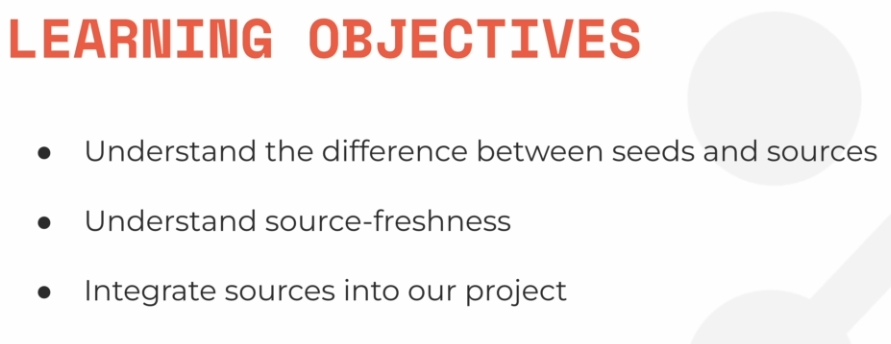
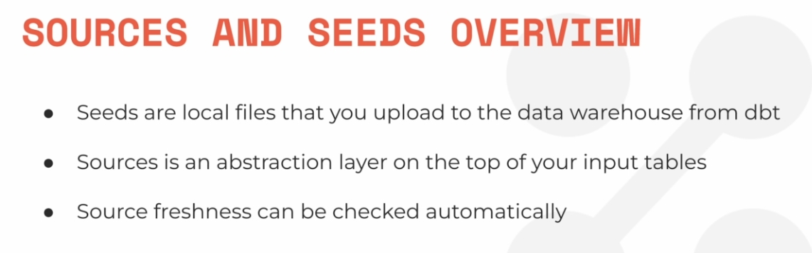

# Seeds e SOurces

O que vamos ver



## DIfernça de Source e Seeds



source é se o dado está dentro do DW, e ssed se você tem que mandar dados pelo dw.

## colocando esedd[

1 - Ponha o arquivocsv na pasta sedd

2 - Execute `dbt seed`

3 - O dbt faz todo o resto

## Tabela mart

mart já sâo as tabeças prontas ara serrem usdas pelo BI

`models/mart`

```sql
{{ config(
 materialized = 'table',
) }}

WITH fct_reviews AS (
 SELECT * FROM {{ ref('fct_reviews') }}
),

full_moon_dates AS (
 SELECT * FROM {{ ref('seed_full_moon_dates') }}
)

SELECT
 r.*,
 CASE
  WHEN fm.full_moon_date IS NULL THEN 'not full moon'
  ELSE 'full moon'
 END AS is_full_moon
FROM
 fct_reviews r
 LEFT JOIN 
  full_moon_dates fm
 ON (TO_DATE(r.review_date) = DATEADD(DAY, 1, fm.full_moon_date))
```

## Sources

sources podem ser definidiso em qualquer lugar da pasta models.

Sao definidmos por um arquivo .yml

Vamos criar no topo da pasta model o seguinte sourec

```yaml
version: 2
sources:
  - name: airbnb
    schema: raw
    tables:
      - name: listings
      identifier: raw_listings
      
      - name: hosts
      identifier: raw_hosts

      - name: reviews
      identifier: raw_reviews
      loaded_at_field: date
      freshness:
        warn_after: {count: 1, period: hour}
        error_after: {count: 24, period: hour}
```

O que estou fazendo:

+ `sources` no dbt serve mais como alias
+ NO caso estou criando o name-space 'airbnb' que vai referenicar aos schema `raw`
+ E criamos alais apra as 3 tabelas, assim, ao invez de usar `AIRBNB.RAW_LISTING` eu vou usar com {{ source('airbnb', 'listings') }}

**COLOQUE AS COISAS EM SOURCE PORQUE CRIA O DIAGRAMD E DEPENDENCIAS DEPOIS**

## Source refresh

fala deese trecho criado no source

````yaml
identifier: raw_reviews
      loaded_at_field: date
      freshness:
        warn_after: {count: 1, period: hour}
        error_after: {count: 24, period: hour}
````
mas PULEI
