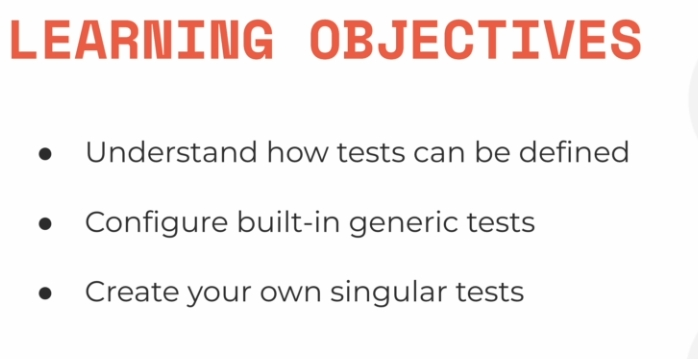
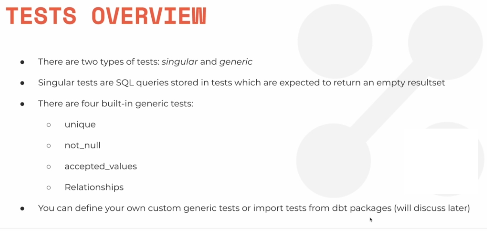

# Tests



## tipos de teste



**Singular Test**:

+ É uma consulta SQL que se espera retornar null
+ Se retornar algo quer dizer que não passou

**Generic Test**:

+ Há 4 defaults: `unique`, `not_null`, `accepted_values`, `Relationships` mas você também pode usar mais pacotes com mais opções ou até mesmo especificar o seu próprio constraint
+ 
## Singular Test

São os testes feito com SQL statement

Você coloca eles na pasta `test/`

```sql
SELECT
 * 
FROM
 {{ ref('dim_listings_cleansed') }}
WHERE minimum_nights < 1
LIMIT 10
```

Para executar só esse teste unicamente, use o código a seguir:

```sh
dbt test --select dim_listings_cleansed
```

Se retornar algo significa que falhou. S enâo retornarnar nada  significa que passou.

==> Outro Singular Test**

`tests/consistent_created_at.sql`

```sql
SELECT * FROM {{ ref('dim_listings_cleansed') }} l
INNER JOIN {{ ref('fct_reviews') }} r
USING (listing_id)
WHERE l.created_at >= r.review_date
```


## Generic Test

São definidos no arquivo `schema.yml` na própria pasta `models/` no atributo `tests` para cada model do `models`.

Generic Test serve para testar ecolunas isoladamente.

```yml
version: 2

models:
  - name: dim_listings_cleansed
    columns:
    
    - name: listing_id
      tests:
        - unique
        - not_null

    - name: host_id
        tests:
          - not_null
          - relationships:
              to: ref('dim_hosts_cleansed')
              field: host_id

    - name: room_type
      tests:
        - accepted_values:
          values: ['Entire home/apt',
            'Private room',
            'Shared room',
            'Hotel room']
```

Execute `dbt test` para executar só os testes. 

