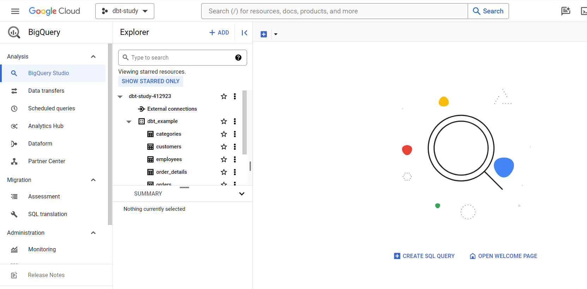

# 02 - BigQuery setup com dbt

## Onde opera o dbt

O DBT em banco de dados, ou seka, é necessário se conectar a algum DW, ou DB para ele funcionar.

## Valor do dbt


## BigQuery: 1TB de movimentaçao 1 1GB de storage FREE

## Tutorial para usar BigQuery com dbt

<https://docs.getdbt.com/guides/bigquery?step=1>

## Configurar corretamente o BigQuery

1 - Tenha uma conta google
2 - Tem que colcoar um carTão de crédito para funcionar,

- se nâo não é possivel fazer nehum DML (SELECT, UPDATE, INSERT)

3 - Criar um DataBase e Depois um Schema

No meu caso é:



````yaml
database: dbt-study-412923
schema: dbt_example
````

4 - Tem que procurar na pasrte de API e exportar as credenciais como JSON. Elas serão usadas concetar o dbt cloud com o DW

5 - Liberar acesso ao GIT. Crei um repo vazio no seu git e use ele ao configurar o repo de projeto dbt