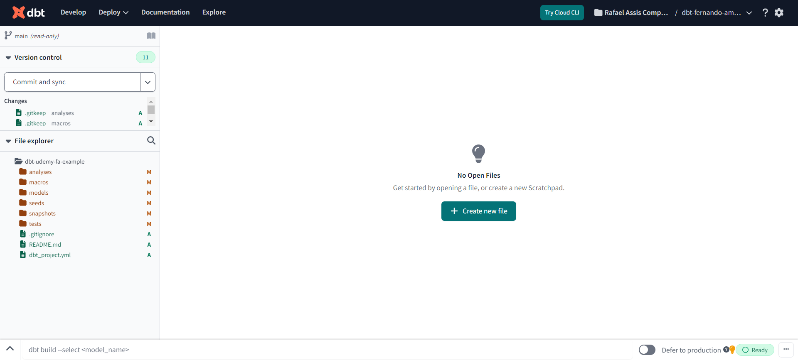

# 03 - scaffold dbt

Esquema de projetos do DBT

## arquivo `dbt-project.yaml`

Onde define as princiapsi configurações e qual será o objetivod e cada pasta

## `models`

**models**: Esta pasta contém os modelos dbt, que são arquivos `.sql` ou `.sqlx` contendo as consultas SQL que definem suas transformações de dados. Cada modelo geralmente corresponde a uma tabela ou visão no seu banco de dados de destino.

### `source.yaml`

Arquivo que define de onde vai ver os dados. Em geral é o `database` e o `schema` a ser usado no dbt.

## `data`

**data**: Esta pasta pode conter arquivos de dados estáticos que são usados como fontes para seus modelos dbt. Esses arquivos podem ser CSV, JSON ou outros formatos suportados. Eles são usados principalmente em ambientes de desenvolvimento e teste.

## `macros`

**macros**: Macros são fragmentos reutilizáveis de código dbt escritos em Jinja ou SQL. A pasta "macros" contém esses arquivos que podem ser invocados em seus modelos dbt para adicionar funcionalidades personalizadas ou reutilizáveis.

## `analysis`

**analysis**: Esta pasta pode conter consultas de análise ou relatórios SQL que não estão diretamente relacionados à construção de suas transformações de dados, mas são úteis para análise e exploração de dados.

## `snapshots`

**snapshots**: Snapshots são consultas SQL que definem estados estáticos de tabelas em momentos específicos no tempo. Eles são úteis para rastrear alterações em dimensões lentamente alteradas ou outros dados historicamente sensíveis.

## `tests`

**tests**: Esta pasta contém testes dbt que validam a qualidade e a integridade dos dados produzidos pelos seus modelos dbt. Os testes dbt são escritos em SQL e podem ser executados automaticamente como parte do pipeline de CI/CD.

## `docs`

**docs**: A pasta de documentos contém arquivos Markdown que descrevem a finalidade e o funcionamento dos modelos dbt, bem como qualquer outra documentação relevante para o projeto.

## `target`

8. **target**: Esta pasta é gerada pelo dbt e contém os artefatos resultantes da compilação e execução dos modelos dbt, como arquivos SQL compilados e logs de execução.

Cada uma dessas pastas desempenha um papel importante na organização e no desenvolvimento de um projeto dbt, ajudando a separar diferentes tipos de artefatos e facilitar a manutenção e colaboração no projeto.
