# 05 - Apredentendo DBT apartir de um projeto prático

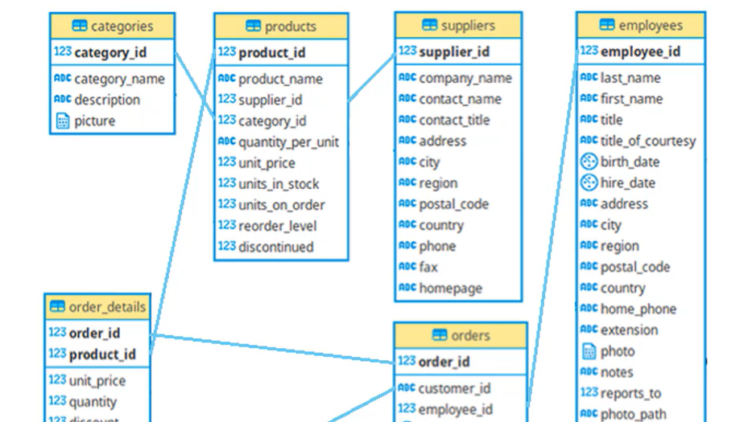

## Repositório do projeto final

<https://github.com/FernandoAmara/dbtproject>

## O que será feito

+ 1 - Remover clientes duplicados (tabela customers)
  + Quando uma pessoa tem o mesmo par de ``company_name`` e ``contact_name``
  
+ 2 - Criar algumas colunas calculadas (tabela employees)
  + Age (birth_date)
  + length_of_service (a partir do hire_date)
  + nome completo (first_name + last_name)

+ 3 - Detalhes do pedido
  + Calcular o total e discount da tabela `order_detail` usando dados da tabela `products`

+ 4 - Desnormalizar tabelas para criar uma tabela Fato de DW
  + Vamos criar várias tabelas para ter várias views de forma a ter uma tabela fato final muito boa para consulta DW

+ 5 - Particionamento
  + Vamos particionar por `order.order_date` para termos uma tabela para cada ano, 2012, 2022, 2023

+ OBS: Uma vez feitas essas modificações, criamos uma nova tabela, assim, deixamos de usar `source` e passamos a usar `ref`

## Observaçõeses gerais sobre o desenvolvimento no DBT

+ **Branch e PR:**
  + Você tem que criar uma branch e depois fazer o PR para a main
  + O deploy em produçâo é feito na branch `main``, entao,temos que fazer o merge da noss abranch par aa mains.
+ **Salvar o arquivo sempre:**
  + Na UI do DBT,vocêcodifica e tem que **SALVAR O ARQUIVO**, só então pode dar o preview ou até mesmo ver as features do dbt.
  + oU SEJA, NAO É COMO O MYSQL; VOCE TEM QUE EESRCEVER O CODIGO SALVAR E DAR O PREVEIW. nOMYSQL VOCE ESCCREVE E EXECUTA O CODIGO NA HORA SEM PRECISAR SALVAR O ARQUIVO.
  + Sempreantes de executar você tem que salva o arquivo, se nao eçe peg ana ultimp verçao aslvaou ates mesmo o arquivo em braanco
+ **Comandos diferentes do RedShift**
  + Os comandos dos models.sql sao comandos para o redshift. No Bigquery podem ser dfifneret,es entoa tive que adapatar os comandos par ao bigqeury quando deram errados
  + ``date_part`` para ``EXTRACT(YEAR FROM date)``
  
## 01 - source.yaml

Definimos o arquivo de `source.yaml` para especificar de onde vai vir os dados e quais são as tabelas

````yaml
version: 2

sources:
    - name: sources # nome a ser usado no dbt para definir esse source
      database: dbt-study-412923 # database do bigQuery
      schema: dbt_example # schema do Bigquery
      tables: # Tabelas que vamos pegar do bigQuery
        - name: categories
        - name: products
        - name: suppliers
        - name: employees
        - name: order_details
        - name: customers
        - name: orders
        - name: shippers
````

## 02 - Arquivo `customers.sql`

Vamos sar um exemplo, no caos, lsitar todos os dados usando o `source`

````sql
select * from {{source('sources','customers')}}

-- Ou dessa outra, referenciando direto
-- select * from `dbt-study-412923.dbt_example.customers`
````

Após fazer isso, clique em preview que assim **VAI EXECUTAR A CONSULTA E MOSTRAR O RESULTADO, MAS AINDA A TABELA NÃO FOI GERADA NO BIGQUERY**

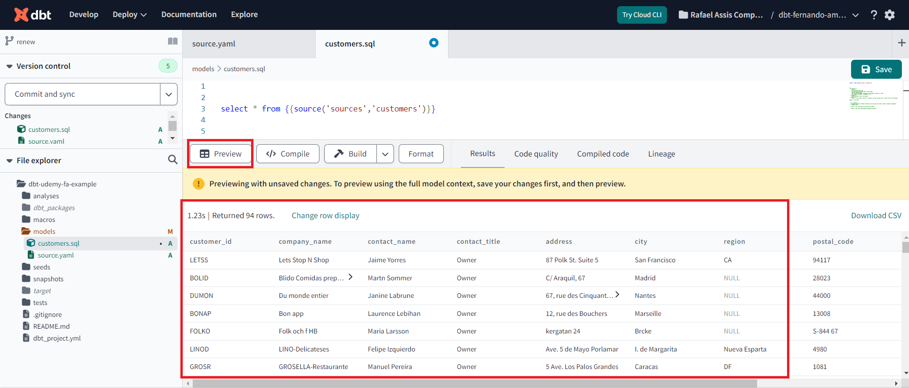

Se você voltar no `source.yaml` vai perceber que na parte de `Lineage` você consegue ver que esse arquivo está referenciando uma das tabelas definadas no arquivo.

Isso é muito úteil para entender em todo o seu projeto dbt onde uma tabela está sendo usada nos `models`

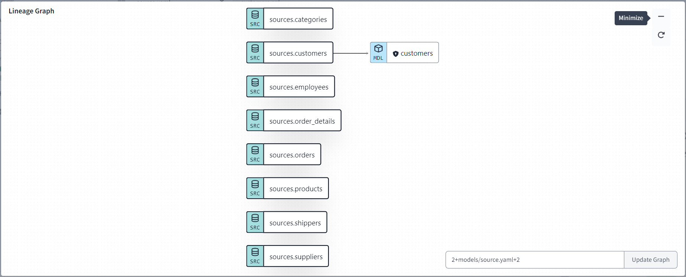

Agora vamos fazer a consulta para remover registros duplicados

````sql
--customer model

-- Etapa 1 - Usamos WINDOWS FUNCTIONS para adicionar uma coluna que vai ter valor
with markup as (
    select * , 
    first_value(customer_id)
    over(
        partition by company_name, contact_name -- vou particionar por essa colunas
        order by company_name -- ordenar pelo nome, nesse caso, é totalmente opcional
        rows between unbounded preceding and unbounded following -- A windows vai começar na 1° janela da particao
    ) as result
    from {{source('sources','customers')}}
), removed as (
    select distinct result from markup
), final as (
    select * from {{source('sources','customers')}} 
    where customer_id in (select result from removed)
)

select * from final
-- Antes eram 94 linhas, ao ifnal, deverá ser 91 linhas
````

Agora execute para consolidar essa tabela customer ()

````sh
# obs: esse comando executa todos os models
dbt run 
````

mas no caso podemos só especificar e rodar um unico modelo:

````sh
dbt run --select customer
````

Aí deve aparecer como a imagem a seguir, onde mostra um novo schema, que possui somente views, no caso com nome `dt_rmoraisdeassis`. Esse nome pode ser alterado nas opçôes do dbt.

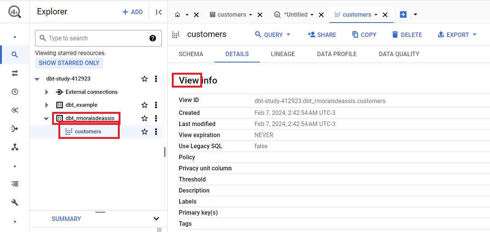


## 03 - Arquivo `models/employees.sql`

````sql

with calc_employees as (
    select 
    EXTRACT(YEAR FROM current_date) - EXTRACT(YEAR FROM birth_date) age, -- caluclar idade em no ano atual (2024)
    EXTRACT(YEAR FROM current_date) - EXTRACT(YEAR FROM hire_date) lengthofservice, -- calcular tempo de servico
    first_name || ' ' || last_name name, -- juntar nome e sobrenome
    * -- pega todas as outras colunas
    from {{source('sources','employees')}}
)

select * from calc_employees
````

depois executar

````
dbt run --select employees
````

## 04 - arquivo ordertail.sql

````sh
select 
    od.order_id, od.product_id, od.unit_price, od.quantity, pr.product_name, pr.supplier_id, pr.category_id,
    od.unit_price * od.quantity as total,
    (pr.unit_price * od.quantity) - (od.unit_price * od.quantity) as discount
from 
    {{source('sources','order_details')}} od
left join 
    {{source('sources','products')}} pr on (od.product_id = pr.product_id)
````

depois executar

````sh
dbt run --select employees
````

## 05 - arquivo ``joins.sql`` desnomalizar tabela de pedidos

````sql
-- 05 - Desnomalizar tabela orde
-- Fazemos isos para facilitar a leitura de BI

with prod as (

    select 
        ct.category_name, sp.company_name suppliers, pd.product_name,
        pd.unit_price, pd.product_id
    from {{source('sources','products')}} pd
    left join {{source('sources','suppliers')}} sp on (pd.supplier_id = sp.supplier_id)
    left join {{source('sources','categories')}} ct on (pd.category_id = ct.category_id)

), orddetai as (

    select pd.*, od.order_id, od.quantity, od.discount
    from {{ref('orderdetails')}} od -- estamos usando 'ref' a tabela criada antes
    left join prod pd on (od.product_id = pd.product_id) -- usando o CTE anterior

), ordrs as (

    select ord.order_date, ord.order_id, cs.company_name customer, em.name employee, em.age, em.lengthofservice
    from {{source('sources','orders')}} ord
    left join {{ref('customers')}} cs on (ord.customer_id = cs.customer_id)
    left join {{ref('employees')}} em on (ord.employee_id = em.employee_id)
    left join {{source('sources','shippers')}} sh on (ord.ship_via = sh.shipper_id)

), finaljoin as (

    select od.*, ord.order_date, ord.customer, ord.employee, ord.age, ord.lengthofservice
    from orddetai od
    inner join ordrs ord on (od.order_id = ord.order_id)

)

select * from finaljoin
````

````sh
dbt run --select joins
````

## 06 - Gerar `partition.sql`

Vamo criar 3 arquivos: partition2020,2021, 2022 e vamos criar consutla para gera partiçoes. vamo difidira table ajoin criada antes em 3 partes, 2020, 2212 e 2022.

Será 4 arquivos, cada um com um select com as datas diferentes

````sql
select * from {{ref('joins')}}
where date_part(year, order_date) = 2020
````

````sh
dbt run --select partition2020
````
``
Se você olhar o linage do `partition2020.sql` você verá que ele pega todos os processo que foram executados para chegar na execução do seu próprio sql.

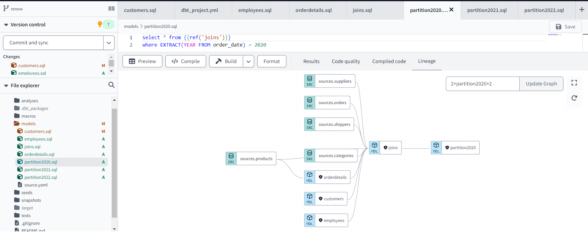

## Deploy em Produção

### PR

Em primeiro lugar é preciso fazer a PR da nossa branch para a branch main. Isso é feito na própria UI do dbt

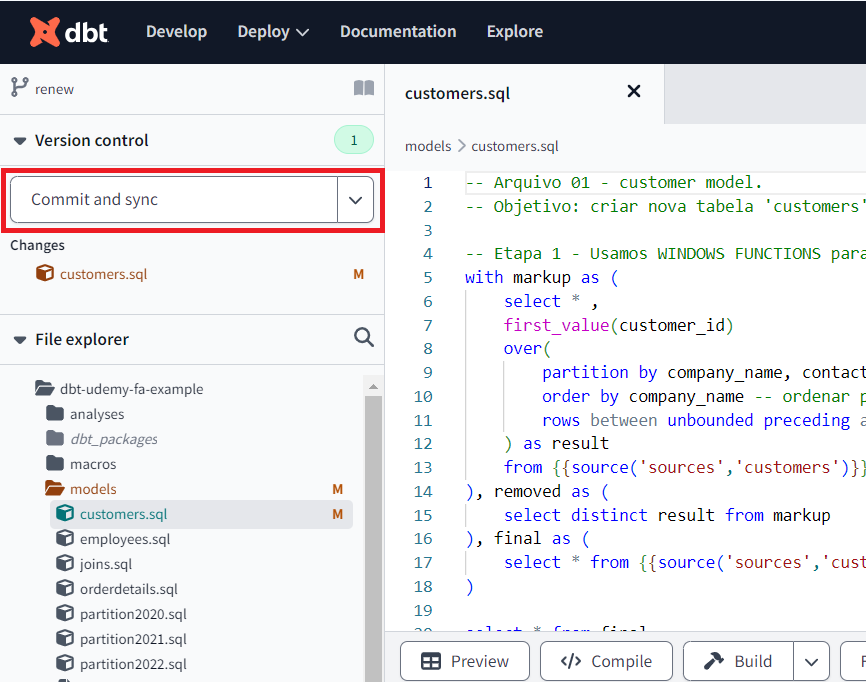


### Enviroment

Vá em `Deploy > Enviroments` e habilite um novo ambiente.

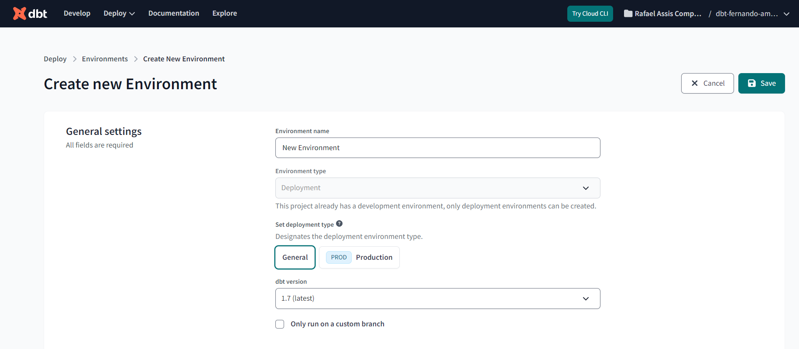

Em Deployment credential coloque como `prod`. Nesse caso, está especificando para o deploy ser feito no schema `prod`.

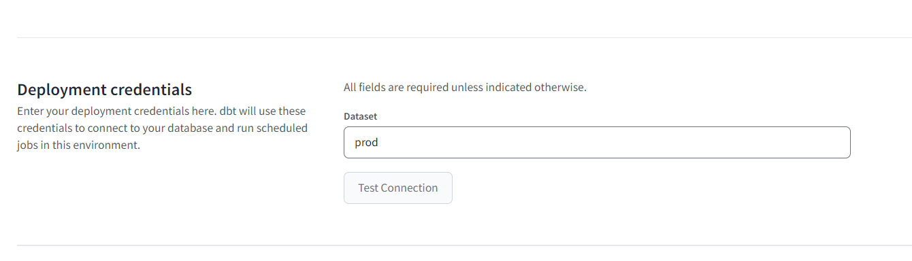

### Job

A execução é feita criando um JOB para o ENVIROEMENT.

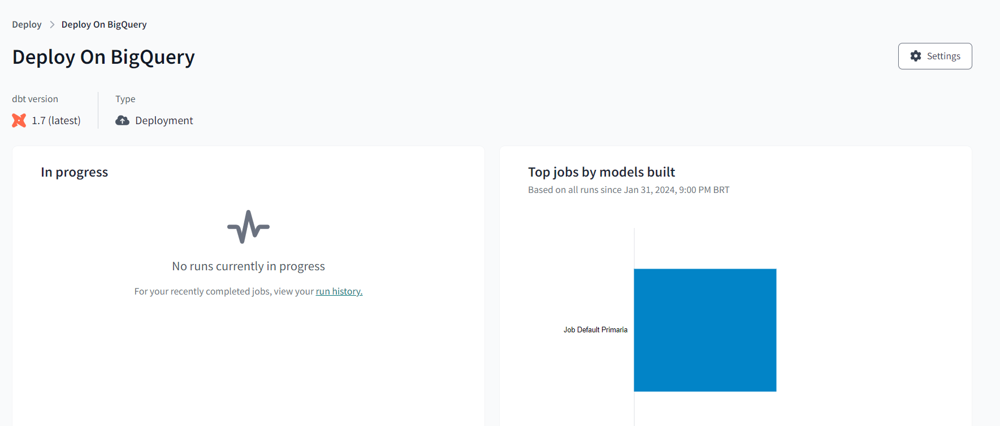

Crie um job

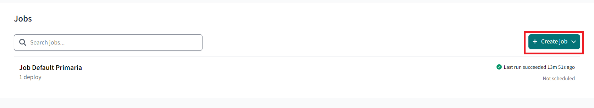

Configure mas não coloque o schedule, pois vamos executar manualmente.

Na tela do Job clique em RUN NOW. Infelismente mesmo sendo um job pequeno acaba demorando umpouco

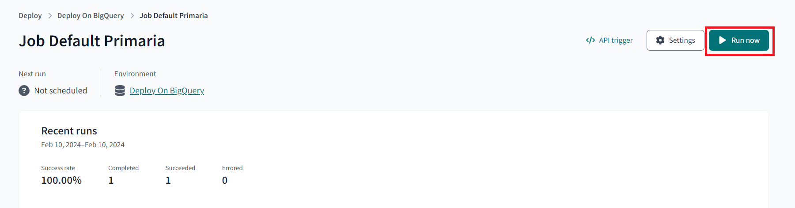

Aí será criado no schema `prod` definido anteriormente no enviroment

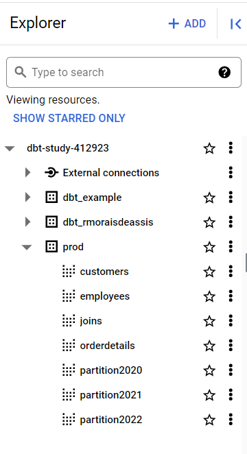