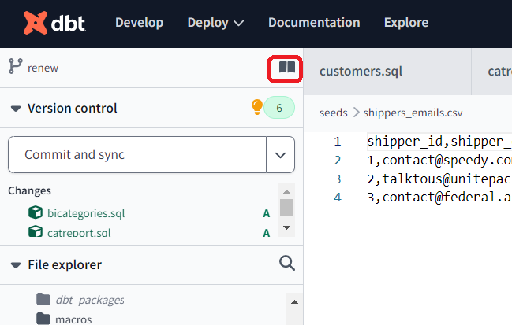
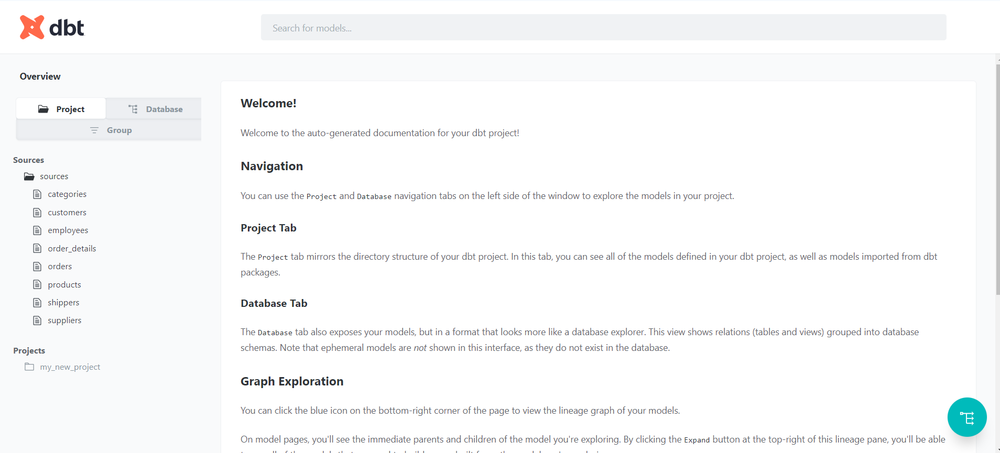
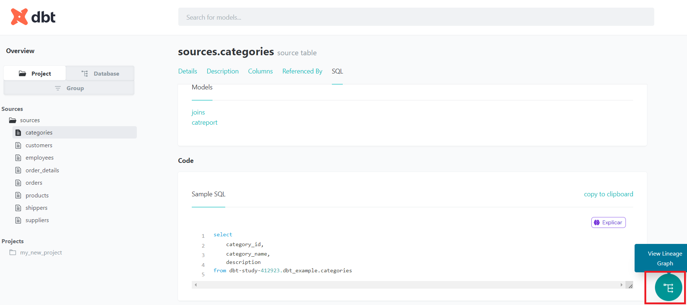

# 06 - dbt - Mais funcionalidades

## Materializations

O dbt trabalha com 4 tpos de materializações:

+ View
  + É a materialização padrão caso você nâo define
  + É uma view, não é uma tabela física, por isso pode ter consultas lentas pois precisa sempre recriar os joins e colunas calculadas. É como um SELECT salvo.
+ Table
  + Cria a tabela física no banco de dados
  + É mais lento em produção pois faz os joins e ainda tem que  salvar os dados no banco. Melhora para dados consultados muitas vezes.
+ Ephemeral
  + É um objeto que nâo é criado no banco de dados, mas que é referenciado no próprio dbt. Ele não é salvo no banco de dados de maneira nenhuma.
  + É uma foram de criar uma tabela temporária
+ Incremental
  + Ele cria a tabela na primeira vez e nas próximas vezes vai só incrementando de acordo com uma regra.
  + Incremental é difenrete de Table, o Table cria tudo do zero de acordo com os dados de origem, já Incremental vai soma, geralmente usando uma data ou chave primária.
  + Quando a tabela incremental é executada, o dbt compara os novos dados com os existentes na tabela e adiciona apenas os registros que são novos. Isso pode ser feito de forma eficiente, especialmente para grandes conjuntos de dados, economizando tempo e recursos de processamento.

### Mostrando ephemeral e incremental - catreport.sql

````sql
-- JINJA: Para configurar o arquivo
-- Se mudar materialized para 'ephemeral' ao rodar, não é criado no banco e de maneira nenhuma
{{
    config(
        materialized='incremental',
        unique_key='category_id'
    )
}}


select * from {{source('sources','categories')}}
````

## Testes no DBT

+ Vocêtesta a lógica do pipeline, ésemelhança com o pytest
+ Os testse sâo arquivos `.sql` na pasta teste, se executar o arquivo e
  + RETONAR LINHA, significa que FALHOU
  + RETORNAR NADA, significa que deu CERTO
  
Para rodar basta executar :

````sh
dbt test
````

No caso, os testes serão feitos para validar se os `models` que criamos estão de uma determinada forma.

Exemplo de arquivo `checkduplic.sql` para testar `customers`

````sql
select 
    count(*) count, company_name, contact_name 
from {{ref('customers')}}
group by company_name, contact_name
having count > 1
````

## Hooks - executar antes/depois do model/pipeline

Os hooks do dbt são:

1. pre-hook: Um comando executado antes de um modelo ser construído.
2. post-hook: Um comando executado após um modelo ser construído.
3. on-run-end: Um comando executado após a execução de um job dbt ser concluída.
4. on-run-start: Um comando executado antes da execução de um job dbt começar.
5. on-success: Um comando executado após um job dbt ser executado com sucesso.
6. on-error: Um comando executado após um job dbt falhar.

### `bireport.sql`

+ Exemplo de hook.
+ Colocado em `models`
+ O que faz: Toda vez que for executado esse model. Vai conceder acesso a todos os usuarios da tabela biusers


````sql
{{
    config(
        materialized='table',
        pre_hook=["begin; lock table {{target.schema}}.bireport;
        "],
        post_hook=["commit;
            GRANT USAGE ON SCHEMA {{target.schema}} TO GROUP biusers;
            GRANT SELECT ON TABLE {{target.schema}}.bireport TO GROUP biusers;

        "]

    )

}}

select * from {{ref('joins')}}
````

## Packages no dbt

São libs feitas que podem adicionar ao dbt

https://hub.getdbt.com/

Agente define em `packages.yml` na raiz  do projeto

````yml
packages:
- package: dbt-labs/logging
  version: 0.6.0
````

Vamos usar o logging

Execute dbt deps apra instalar o package

````sh
dbt deps
````

Vamosa usar package de logging com hoookes para registrar log em todas as modesl.

Vamos colocar esse registro em `dbt_project.yml`

````yml
models:
  pre-hook: "{{ logging.log_model_start_event()}}"
  post-hook: "{{ logging.log_model_end_event() }}"
````

Essepackage cria a tabela `dbt_audit_log` que registr os logs

## Variáveis

Podem ser deifnidas no arquivo de projeto, em `dbt_project.yml`

````yml
vars:
  category: Seafood
````
Coloca isso em algum lugar que vai ser uma variável podendo esr acessada em qualquer lugar

Depois vamos criar o arquivo `bicategories.sql` que vai ler a constante pela variávelque definimos.

````sql
select * from {{ref('joins')}}
where category_name = '{{var('category')}}'
````

## Seeds

É como fazer um upload de arquivo `csv` como se fosse uma `ref`.

Seeds são colocados na pasta `seeds`

`seeds/shippers_emails.csv`

````csv
shipper_id,shipper_email
1,contact@speedy.com
2,talktous@unitepackge.com
3,contact@federal.ar
````

Depois executamos o comando dbt seed para carregar esse csv e ee se tornar uma ref no nosso projeto

````sh
dbt seed
````

Depois crie o arquivo `models/newshippers.sql`

````sql
select sh.company_name, se.shipper_email 
from {{source('sources','shippers')}} sh
left join {{ref('shippers_emails')}} se on (sh.shipper_id = se.shipper_id)
````

depois rode para executar

````sh
dbt run --select newshippers
````

só depois que executar aqui, é que vai isntanciar mesmo o seed, e só depois, vai dá pra ver pelo `preview` do dbt

## Gerar documentaçâo automática

````sh
dbt docs generate
````

Clique no livrinho para ver a documentação



vai abrir uma página coma  documentaçâo



Ele dá uma quantidade enorme de informaçôes, tanto do sources,quanto das consutlas comodo DW que está referenciando.

## Documentação - Lineage



Se você ler o lineage do proejto,você consegue ver tudo:


## Macros

Sâo blocos de código que podem ser executados em qualquer pearte, como se fosse uma funçâo.

Ex: Você pode criar umamacro para voltar somente 4 colunas somente, e asism, todo lugar que você chamar ela, vai pegar só essas 4

Os arquivos de macro ficam na pasta `macro`

Sâo arquivos SQL eo nome do arquivo nâo infleuncia nelas

macros/campos.sql

````sql

{{ return('
    category_name,
    suppliers,
    product_name,
    product_id
')
}}

````

Deifinimos uma macro que retorna 4 campos,assim, podemos usar ele nos nososs `models`. Vamos alterar `bicategories.sql`

````sql
select {{retorna_campos()}} from {{ref('joins')}}
where category_name = '{{var('category')}}'
````
